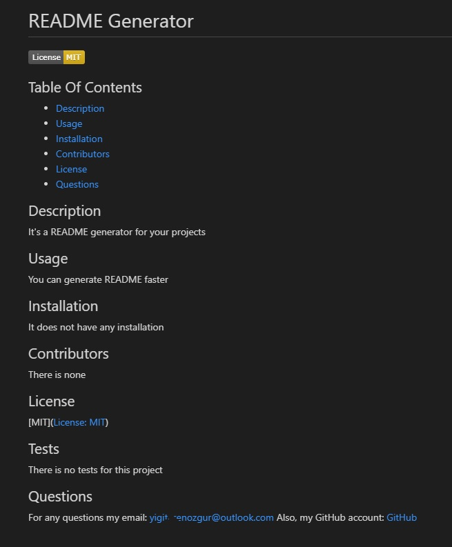

# **Professional README Generator**

## Table of Contents

* [Description](#description)
* [Requirements](#requirements)
* [Installation](#installation)

## Description
---

This is a README generator for your projects, this will help you create README faster so you don't have to spend more time on it.

The screen shot of the generated README;



---

## Requirements
---
```md
GIVEN a command-line application that accepts user input
WHEN I am prompted for information about my application repository
THEN a high-quality, professional README.md is generated with the title of my project and sections entitled Description, Table of Contents, Installation, Usage, License, Contributing, Tests, and Questions
WHEN I enter my project title
THEN this is displayed as the title of the README
WHEN I enter a description, installation instructions, usage information, contribution guidelines, and test instructions
THEN this information is added to the sections of the README entitled Description, Installation, Usage, Contributing, and Tests
WHEN I choose a license for my application from a list of options
THEN a badge for that license is added near the top of the README and a notice is added to the section of the README entitled License that explains which license the application is covered under
WHEN I enter my GitHub username
THEN this is added to the section of the README entitled Questions, with a link to my GitHub profile
WHEN I enter my email address
THEN this is added to the section of the README entitled Questions, with instructions on how to reach me with additional questions
WHEN I click on the links in the Table of Contents
THEN I am taken to the corresponding section of the README
```

## Installation
---
There is no installations to this project, you can see the repository and video of how to use it here.

See repository here: https://github.com/erenozgur98/professional-readme-generator

See video link here: https://drive.google.com/file/d/1c-ynXZHkb6hVD8npir2qMjnJIi4myYNX/view
